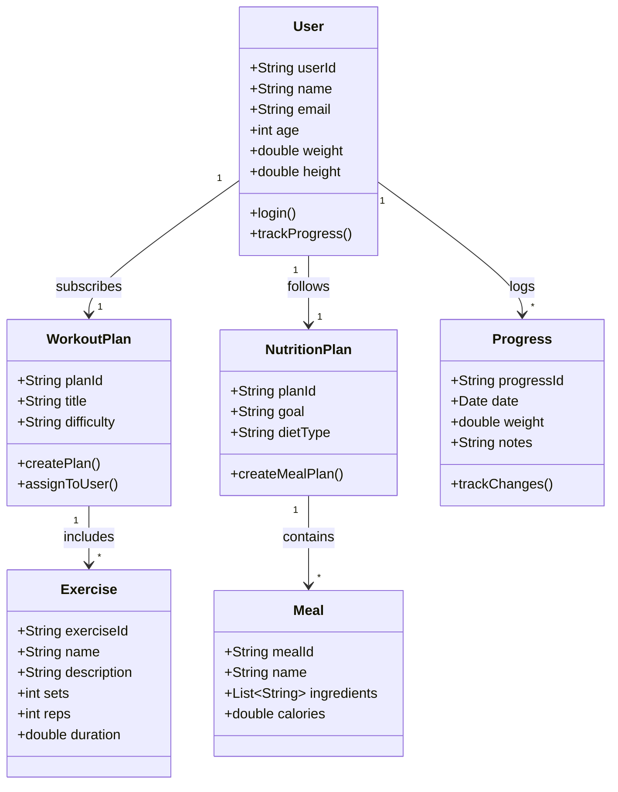

```mermaid
 classDiagram

class User {
  +String userId
  +String name
  +String email
  +int age
  +double weight
  +double height
  +login()
  +trackProgress()
}

class WorkoutPlan {
  +String planId
  +String title
  +String difficulty
  +createPlan()
  +assignToUser()
}

class Exercise {
  +String exerciseId
  +String name
  +String description
  +int sets
  +int reps
  +double duration
}

class NutritionPlan {
  +String planId
  +String goal
  +String dietType
  +createMealPlan()
}

class Meal {
  +String mealId
  +String name
  +List~String~ ingredients
  +double calories
}

class Progress {
  +String progressId
  +Date date
  +double weight
  +String notes
  +trackChanges()
}

User "1" --> "1" WorkoutPlan : subscribes
WorkoutPlan "1" --> "*" Exercise : includes
User "1" --> "1" NutritionPlan : follows
NutritionPlan "1" --> "*" Meal : contains
User "1" --> "*" Progress : logs


```
