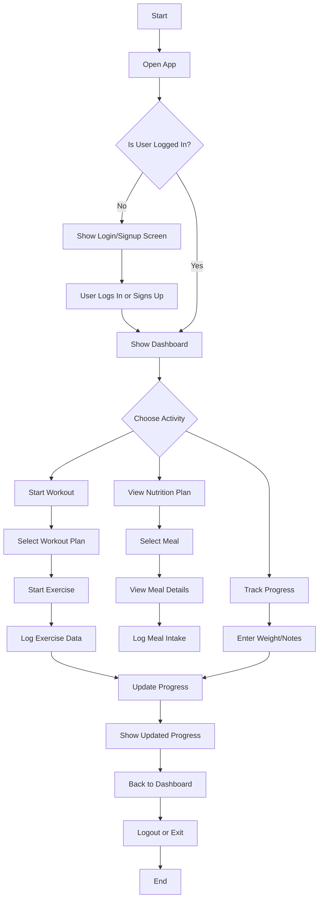

```mermaid
flowchart TD
  A[Start] --> B[Open App]
  B --> C{Is User Logged In?}
  C -- No --> D[Show Login/Signup Screen]
  D --> E[User Logs In or Signs Up]
  E --> F[Show Dashboard]
  C -- Yes --> F[Show Dashboard]

  F --> G{Choose Activity}
  G --> H[Start Workout]
  G --> I[View Nutrition Plan]
  G --> J[Track Progress]

  H --> K[Select Workout Plan]
  K --> L[Start Exercise]
  L --> M[Log Exercise Data]
  M --> N[Update Progress]

  I --> O[Select Meal]
  O --> P[View Meal Details]
  P --> Q[Log Meal Intake]

  J --> R[Enter Weight/Notes]
  R --> N

  N --> S[Show Updated Progress]
  S --> T[Back to Dashboard]
  T --> U[Logout or Exit]
  U --> V[End]
```
