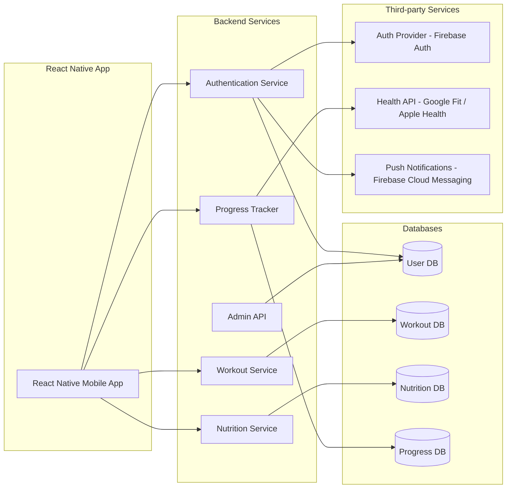

```mermaid
flowchart LR

    %% Client
    subgraph CLIENT [React Native App]
        A1[React Native Mobile App]
    end

    %% Backend Services
    subgraph BACKEND [Backend Services]
        B1[Authentication Service]
        B2[Workout Service]
        B3[Nutrition Service]
        B4[Progress Tracker]
        B5[Admin API]
    end

    %% Databases
    subgraph DATABASE [Databases]
        D1[(User DB)]
        D2[(Workout DB)]
        D3[(Nutrition DB)]
        D4[(Progress DB)]
    end

    %% External Services
    subgraph THIRD_PARTY [Third-party Services]
        T1[Auth Provider - Firebase Auth]
        T2[Health API - Google Fit / Apple Health]
        T3[Push Notifications - Firebase Cloud Messaging]
    end

    %% Client to Backend
    A1 --> B1
    A1 --> B2
    A1 --> B3
    A1 --> B4

    %% Backend to Databases
    B1 --> D1
    B2 --> D2
    B3 --> D3
    B4 --> D4
    B5 --> D1

    %% Backend to External Services
    B1 --> T1
    B4 --> T2
    B1 --> T3
```
